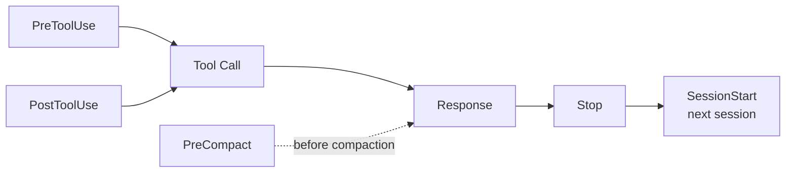

<div align="center">

# Harness Starter

A ready-to-use Claude Code Harness Engineering template  
Works with both new and existing projects

<p>
  
  
</p>

> Other platforms (Cursor, Codex, Gemini, etc.): just tell your AI "adapt this template to my environment"

</div>

---

## Design

Every new project requires repeating the same rules to the AI: tech stack, test commands, files to avoid.

Harness Starter automates this through hooks. Install once, use across all projects.

---

## Quick Start

### Option 1: Let AI Set It Up (Recommended)

Tell Claude Code:

```
Initialize this project with Harness Starter
```

The AI will:
1. Clone the template from GitHub
2. Detect your project's tech stack
3. Fill in CLAUDE.md, install Language Server
4. Run health check to confirm everything is ready

### Option 2: npm Install

```bash
npx harness-starter              # Install to current dir
npx harness-starter /path/to/proj  # Install to target dir
```

Then tell Claude Code `initialize Harness` to complete setup.

### Option 3: Manual Setup

```bash
# Clone the template
git clone https://github.com/<your-org>/Harness-Starter.git /tmp/harness

# Copy to your project
cp -r /tmp/harness/.claude/  /path/to/your-project/.claude/
cp    /tmp/harness/CLAUDE.md /path/to/your-project/CLAUDE.md
cp    /tmp/harness/.lsp.json /path/to/your-project/.lsp.json

# Install language server
npm install -g typescript-language-server   # TypeScript
pip install pyright                         # Python

# Verify
cd /path/to/your-project && node scripts/check.mjs

# Tell Claude Code: initialize Harness
```

---

## Architecture

During a conversation lifecycle, hooks fire automatically in this order:



| Hook | Timing | Purpose |
|------|--------|---------|
| PreToolUse | Before tool execution | Safety: .env protection, dangerous commands |
| PostToolUse | After edits | Auto-format code |
| PreCompact | Before context compaction | Preserve session state |
| Stop | After each response | Audit changes, generate review |
| SessionStart | New session begins | Inject git status, review history |

---

## Usage

### AI Setup (Recommended)

Tell Claude Code:

```
Initialize this project with Harness Starter
```

The AI will:

1. **Fetch** the template from GitHub
2. **Copy** `.claude/`, `CLAUDE.md`, `.lsp.json` into your project
3. **Detect** your tech stack from `package.json` / `pyproject.toml` / `go.mod`
4. **Configure** CLAUDE.md placeholders, install Language Server
5. **Verify** with `node scripts/check.mjs`

> If the files are already in your project, just say "initialize Harness."

The full initialization flow is defined in `.claude/skills/harness-init/SKILL.md`.

### Manual Setup

```bash
# 1. Clone template
git clone https://github.com/<your-org>/Harness-Starter.git /tmp/harness

# 2. Copy to project
cp -r /tmp/harness/.claude/  /path/to/your-project/.claude/
cp    /tmp/harness/CLAUDE.md /path/to/your-project/CLAUDE.md
cp    /tmp/harness/.lsp.json /path/to/your-project/.lsp.json

# 3. Install language server
npm install -g typescript-language-server   # TypeScript
pip install pyright                         # Python

# 4. Verify
cd /path/to/your-project && node scripts/check.mjs

# 5. Tell Claude Code: initialize Harness
```

---

## Project Structure

```
your-project/
├── CLAUDE.md                   AI behavior rules
├── .lsp.json                   LSP configuration
├── package.json                npm distribution
├── scripts/
│   ├── check.mjs               Health check
│   ├── init.mjs                One-click install
│   └── upgrade.mjs             Upgrade sync
│
├── .claude/
│   ├── settings.json           Hook registration
│   ├── .harness-state          State awareness
│   ├── skills/
│   │   ├── harness-init/       AI setup workflow
│   │   └── harness-mode/       Workflow modes
│   └── hooks/
│       ├── pre-tool-check.mjs  Safety interceptor
│       ├── post-tool-check.mjs Auto formatter
│       ├── session-context.mjs Context injection
│       ├── session-review.mjs  Change review
│       └── pre-compact.mjs     Long-session guard
│
├── .github/
│   └── workflows/
│       └── harness-check.yml   CI check
```

---

## Customization

### Language Support

`.lsp.json` defaults to TypeScript. For other languages:

```json
// Python
{ "python": { "command": "pyright-langserver", "args": ["--stdio"], "extensionToLanguage": { ".py": "python" } } }

// Go
{ "go": { "command": "gopls", "args": [], "extensionToLanguage": { ".go": "go" } } }
```

---

## Extensions

The following features are disabled by default. Enable them as needed.

### Workflow Modes

Harness supports three modes that auto-tune review strictness:

| Mode | Effect |
|------|--------|
| `/harness-mode full` | Full checks, all rules active |
| `/harness-mode hotfix` | Emergency fix, skip line/file count checks |
| `/harness-mode tweak` | Minimal, .env protection only |

Three phases also affect behavior:

| Phase | Effect |
|------|--------|
| `/harness-phase design` | Relaxed review, skip debug residue checks |
| `/harness-phase build` | Normal review |
| `/harness-phase fix` | Tightened, warn if >5 files changed |

State is stored in `.claude/.harness-state` and injected at SessionStart. See `.claude/skills/harness-mode/SKILL.md`.

### Quality Evaluation (Eval)

Connect Stop Hook review results to automated evaluation to track AI output quality:
- Add correctness scores to review reports
- Track defect rate per change
- Set a quality baseline and alert when it drops

### Multi-Agent Teams

Split complex tasks across multiple agents for parallel work:
- Explore multiple approaches simultaneously and compare results
- Separate frontend/backend/testing into parallel streams
- Isolate long-running tasks from the main conversation

---

## Migration

```bash
cp -r .claude/ CLAUDE.md .lsp.json /path/to/new-project/
```

Edit the first three lines of CLAUDE.md, reinstall the language server, and you're ready to go.

---

<div align="center">

[中文版](README.md) · MIT License

</div>
