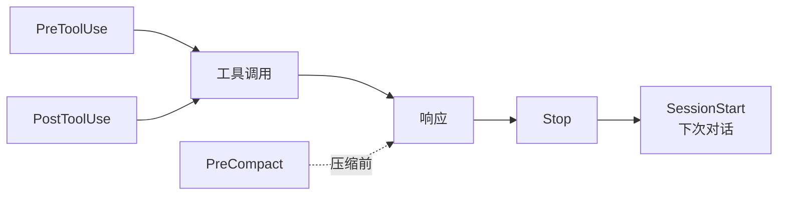

<div align="center">

# Harness Starter

一套开箱即用的 Claude Code Harness Engineering 模板  
新项目和已有项目均可使用

<p>
  
  
</p>

</div>


---

## 设计思路

每次新建项目或打开已有项目时，都需要反复告诉 AI 同样的规则：技术栈是什么、测试怎么跑、哪些文件不能动。

Harness Starter 把这些重复劳动固化为三层自动化机制。装一次，所有项目通用。

---

## 快速开始

### 方式一：让 AI 帮你安装（推荐）

在 Claude Code 中输入：

```
帮我用 Harness Starter 初始化这个项目
```

AI 会：
1. 从 GitHub 拉取模板文件
2. 检测项目技术栈，填写 CLAUDE.md
3. 安装对应的 Language Server
4. 运行健康检查确认一切就绪

### 方式二：手动复制

```bash
# 复制模板文件
cp -r .claude/ CLAUDE.md .lsp.json /path/to/your-project/

# 在 Claude Code 中完成初始化
# 输入：帮我初始化 Harness
```

---

## 整体架构

一条对话的生命周期中，Hook 按以下顺序自动触发：



| Hook | 时机 | 职责 |
|------|------|------|
| PreToolUse | 工具执行前 | 安全拦截：.env 保护、危险命令 |
| PostToolUse | 编辑完成后 | 自动格式化代码 |
| PreCompact | 上下文压缩前 | 保存会话关键状态 |
| Stop | 每次响应后 | 审查变更、生成报告 |
| SessionStart | 新对话开始 | 注入 git 状态、历史审查 |

---

## 使用方式

### AI 自动安装（推荐）

在 Claude Code 中直接说：

```
帮我用 Harness Starter 初始化这个项目
```

AI 会自动完成全流程：

1. **拉取模板**：从 GitHub 克隆最新版本
2. **复制文件**：将 `.claude/`、`CLAUDE.md`、`.lsp.json` 复制到项目
3. **检测技术栈**：读取 `package.json` / `pyproject.toml` / `go.mod` 等
4. **填写配置**：替换 CLAUDE.md 占位符，安装 Language Server
5. **验证**：运行 `node scripts/check.mjs` 确认一切就绪

> 如果文件已在项目中，直接说「帮我初始化 Harness」即可。

完整的初始化流程定义在 `.claude/skills/harness-init/SKILL.md` 中。

### 手动设置

如果希望手动操作：

```bash
# 1. 克隆模板
git clone https://github.com/chenklein26-maker/Harness-Starter.git /tmp/harness

# 2. 复制到项目
cp -r /tmp/harness/.claude/  /path/to/your-project/.claude/
cp    /tmp/harness/CLAUDE.md /path/to/your-project/CLAUDE.md
cp    /tmp/harness/.lsp.json /path/to/your-project/.lsp.json

# 3. 安装语言服务
npm install -g typescript-language-server   # TypeScript
pip install pyright                         # Python

# 4. 验证
cd /path/to/your-project && node scripts/check.mjs

# 5. 在 Claude Code 中完成初始化
# 输入：帮我初始化 Harness
```

---

## 项目结构

```
your-project/
├── CLAUDE.md                   AI 行为规则
├── .lsp.json                   LSP 配置
├── scripts/
│   └── check.mjs               健康检查
│
├── .claude/
│   ├── settings.json           Hook 注册
│   ├── skills/
│   │   └── harness-init/
│   │       └── SKILL.md        AI 安装向导
│   └── hooks/
│       ├── pre-tool-check.mjs  .env 文件保护
│       ├── session-context.mjs git 状态注入
│       └── session-review.mjs  变更审查报告
```

---

## 自定义

### 语言支持

`.lsp.json` 默认为 TypeScript。其他语言：

```json
// Python
{ "python": { "command": "pyright-langserver", "args": ["--stdio"], "extensionToLanguage": { ".py": "python" } } }

// Go
{ "go": { "command": "gopls", "args": [], "extensionToLanguage": { ".go": "go" } } }
```

---

## 扩展指南

以下功能默认不开启，需要时按需解锁。

### 安全增强

`pre-tool-check.mjs` 中注释了更多拦截规则，取消注释即可启用：
- `rm -rf` 危险操作拦截
- `git push --force` 拦截
- `git reset --hard` 拦截

### 质量评估（Eval）

将 Stop Hook 的审查结果接入自动化评估，跟踪 AI 输出质量趋势：
- 在审查报告中增加正确性评分
- 记录每次改动的缺陷率
- 建立质量基线，低于阈值时告警

### 多 Agent 团队

复杂任务可以拆分为多个 Agent 分工协作。适用场景：
- 同时探索多个方案并对比结果
- 前端/后端/测试分离并行
- 长期运行的任务与主会话隔离

---

## 迁移

```bash
cp -r .claude/ CLAUDE.md .lsp.json /path/to/new-project/
```

修改 CLAUDE.md 前三行，重新安装 language server，即可在新项目中使用。

---

<div align="center">

[English](README.en.md) · MIT License

</div>
